# Buffalo Property Data
Buffalo provides great geospacial data through their [open data program](https://data.buffalony.gov/). But, as of this writing, the city does not have a facility to access property assessment data. Luckily, the city's [Online Assessment Role System (OARS)](https://buffalo.oarsystem.com/) provides a lot of tax, assessment and structure information. For this page, data was obtained from the **OARS** site in late 2018, then again in late 2019 after the city underwent a reassessment.

## Buffalo Parcels from Open Data Buffalo
Here is a map of the raw parcel data obtained from data.buffalony.gov
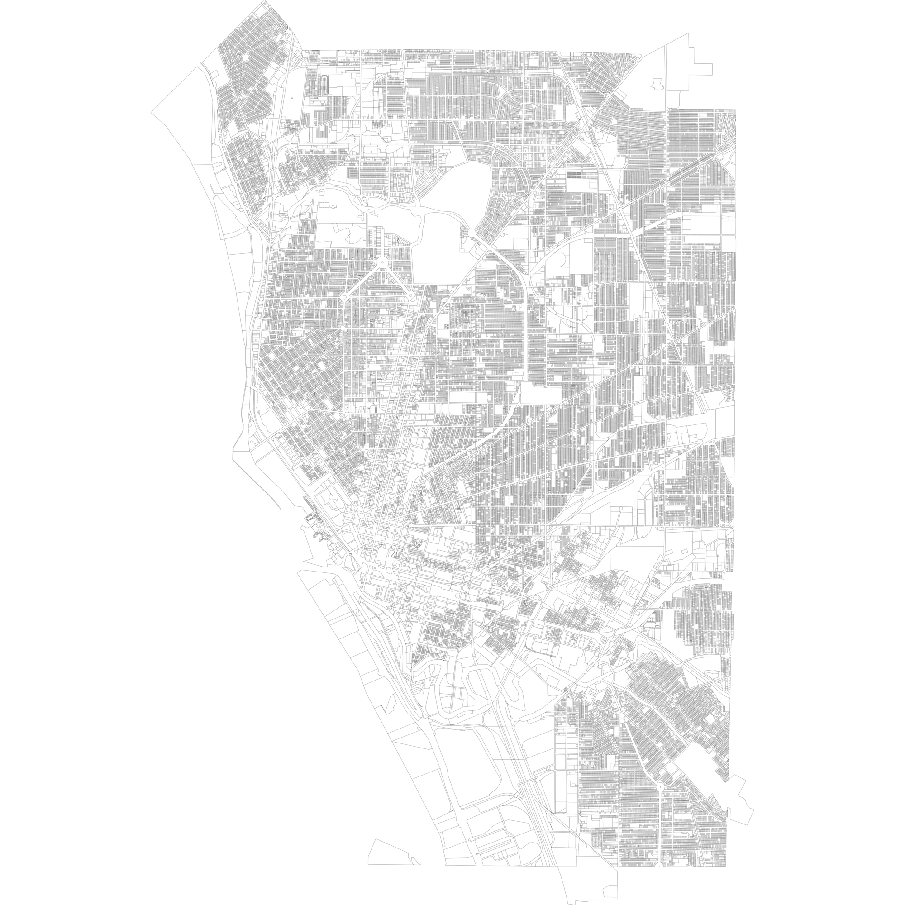

And here's a map of those parcels color-coded based on the *use code* pulled from the **OARS** data
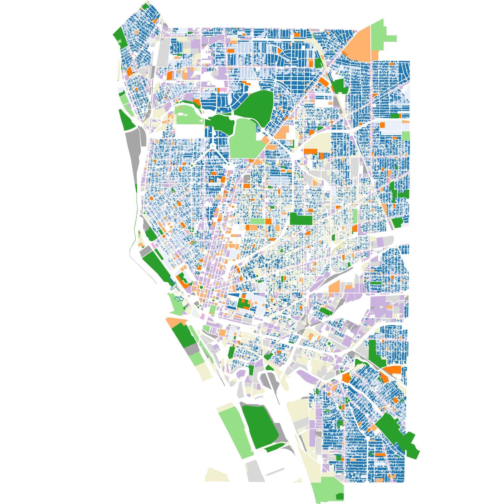
TODO (categorical legend with counts)

Note some rights of way and various other parcels do not have **OARS** data associated with them:
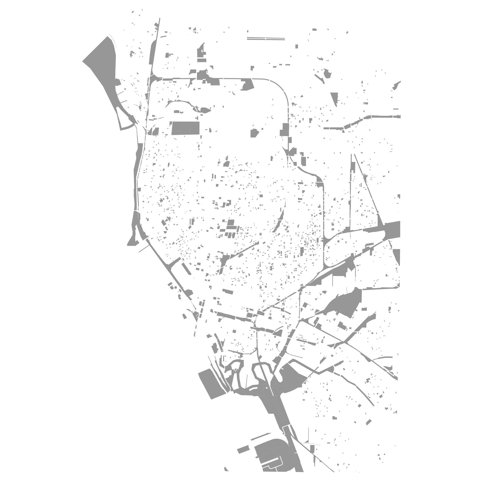

## Single family homes: Assessed Value
### Assessed Fair Market Value for single family homes
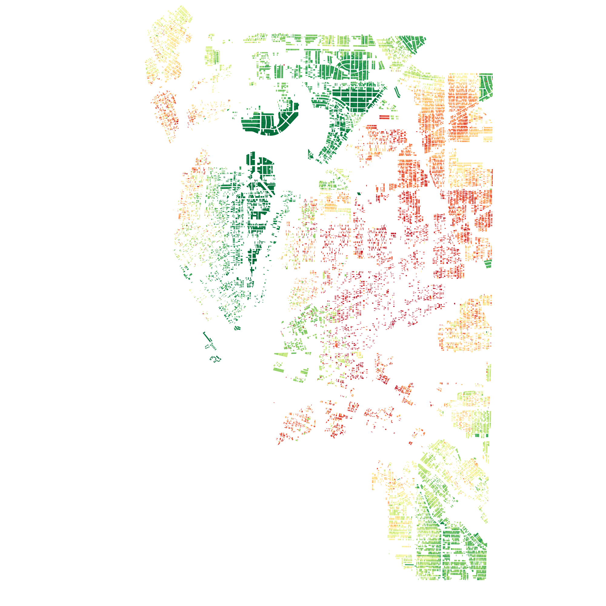
```
cat ./final1.ndjson | ndjson-filter 'd.properties && d.properties.oars_props && d.properties.oars_props.use == "210 - 1 Family Res"' | ndjson-map "parseFloat(d.properties.oars_props.assessment.fmv.replace(/[\$,]/g, ''))" | dtk quantile 100 | tee percentiles/single-family-assessment.txt

mkgeo-render data/buffalo/oars-2019/final1.ndjson -f 'd.properties && d.properties.oars_props && d.properties.oars_props.use == "210 - 1 Family Res" && d.properties.oars_props.assessment.fmv' -M mappers/choropleth.js -d "{f: function(d){ return parseFloat(d.properties.oars_props.assessment.fmv.replace(/[\$,]/g, ''))}, colorScale: d3.scaleSequential(d3.interpolateRdYlGn), minmax: $(echo -n '['; cat data/buffalo/oars-2019/percentiles/single-family-assessment.txt | cut -f 2 | tr '\n' ',' | sed 's|,$|]|')}" --size 8000 -o output/buffalo-properties/single-family-assessment
TODO (scale legend has counts)
```

### Assessed FMV per sqft for single family homes

```
cat ./final1.ndjson | ndjson-filter 'd.properties && d.properties.oars_props && d.properties.oars_props.use == "210 - 1 Family Res"' | ndjson-map 'parseFloat(d.properties.oars_props.assessment.fmv.replace(/[\$,]/g, "")/d.properties.oars_props.structures[0].total_sqft)' | dtk quantile 100 | tee percentiles/single-family-assessment-per-sqft.txt

mkgeo-render data/buffalo/oars-2019/final1.ndjson -f 'd.properties && d.properties.oars_props && d.properties.oars_props.use == "210 - 1 Family Res" && d.properties.oars_props.assessment.fmv && d.properties.oars_props.structures[0] && d.properties.oars_props.structures[0].total_sqft' -M mappers/choropleth.js -d "{f: function(d){ return parseFloat(d.properties.oars_props.assessment.fmv.replace(/[\$,]/g, '')/Math.pow(d.properties.oars_props.structures[0].total_sqft,2))}, colorScale: d3.scaleSequential(d3.interpolateRdYlGn), minmax: $(echo -n '['; cat data/buffalo/oars-2019/percentiles/single-family-assessment-per-sqft.txt | cut -f 2 | tr '\n' ',' | sed 's|,$|]|')}" --size 8000 -o output/buffalo-properties/single-family-assessment-per-sqft-squared
```
If you switch back and forth between these two photos, you notice that there are certain areas of the city where price per sqft percentile diverges from price percentile. This wouldn't be true if it always held that "Bigger houses are nicer houses." Here's a map which shows this divergence, i.e. smaller, more desirable houses and larger less desirable houses.

(graph TODO)

### 2019 Assessment change heat map
Buffalo underwent a city-wide reassessment in 2019. Ultimately, the total fair market value of all properties that we have data for went up 26.8% from $12,899,640,205.00 to $16,353,575,670.50. Of that total, single-family homes made up 29.5% of the total in the new assessment, going up by 20.3% from $4,013,993,150.82 to $4,827,295,224.66.

This map shows the percent change in assessed value of single family homes.
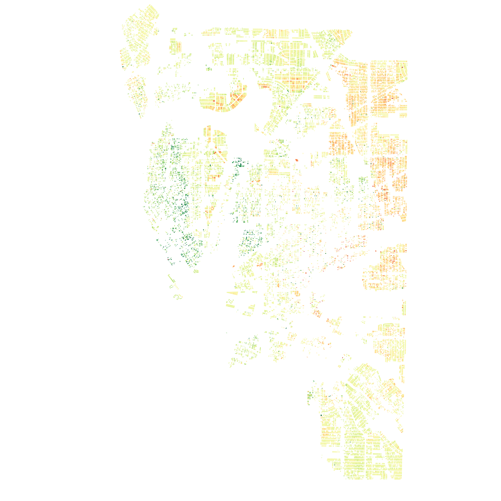
```
mkgeo-render data/buffalo/oars-2019/final1_assessment_history.ndjson -f 'd.properties && d.properties.oars_props && d.properties.oars_props.use == "210 - 1 Family Res" && d.properties.oars_props.assessment_2018.fmv && d.properties.oars_props.assessment.fmv' -M mappers/choropleth.js -d "{f: function(d){ return parseFloat(d.properties.oars_props.assessment.fmv.replace(/[\$,]/g, ''))/parseFloat(d.properties.oars_props.assessment_2018.fmv.replace(/[\$,]/g, ''))}, colorScale: d3.scaleSequential(d3.interpolateRdYlGn), minmax: [0.25,1,4]}" --size 8000 -o output/buffalo-properties/single-family-assessment-change
```

When all property types are added back to the picture, you get a better sense of how (and where) things changed since the last reassessment.

#### Relative (percent) Change
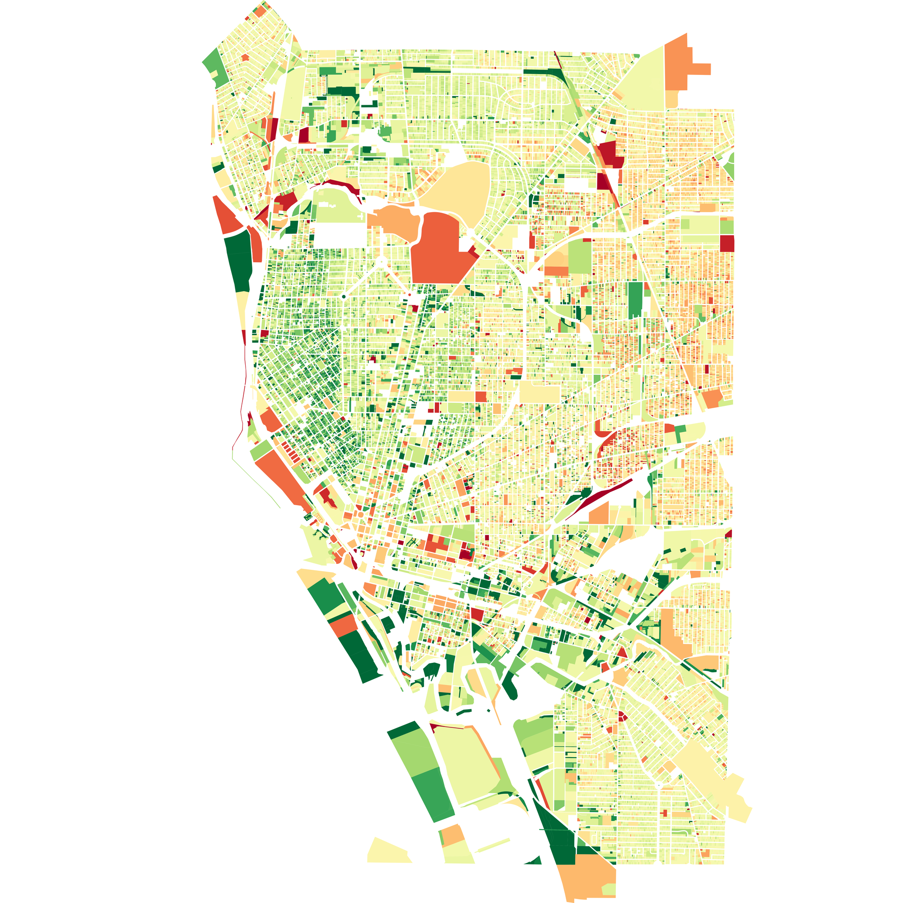

#### Absolute (dollar amount) Change
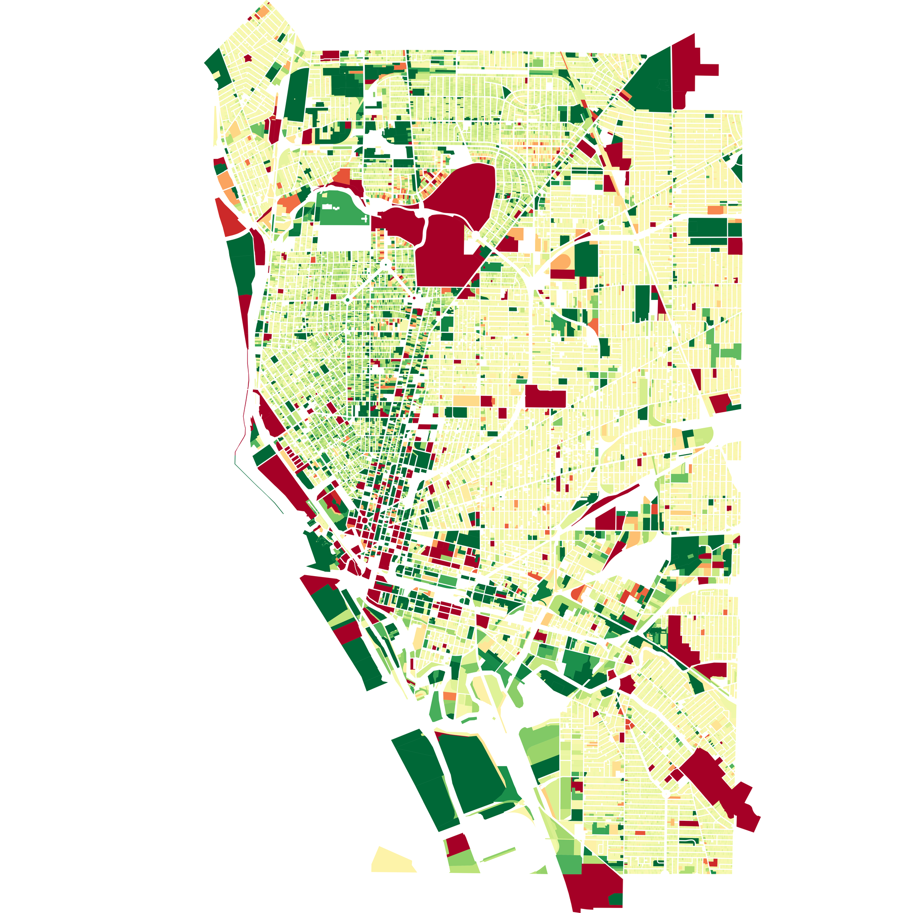


## Historical heatmaps
### Year Built (red-yellow-green scale)
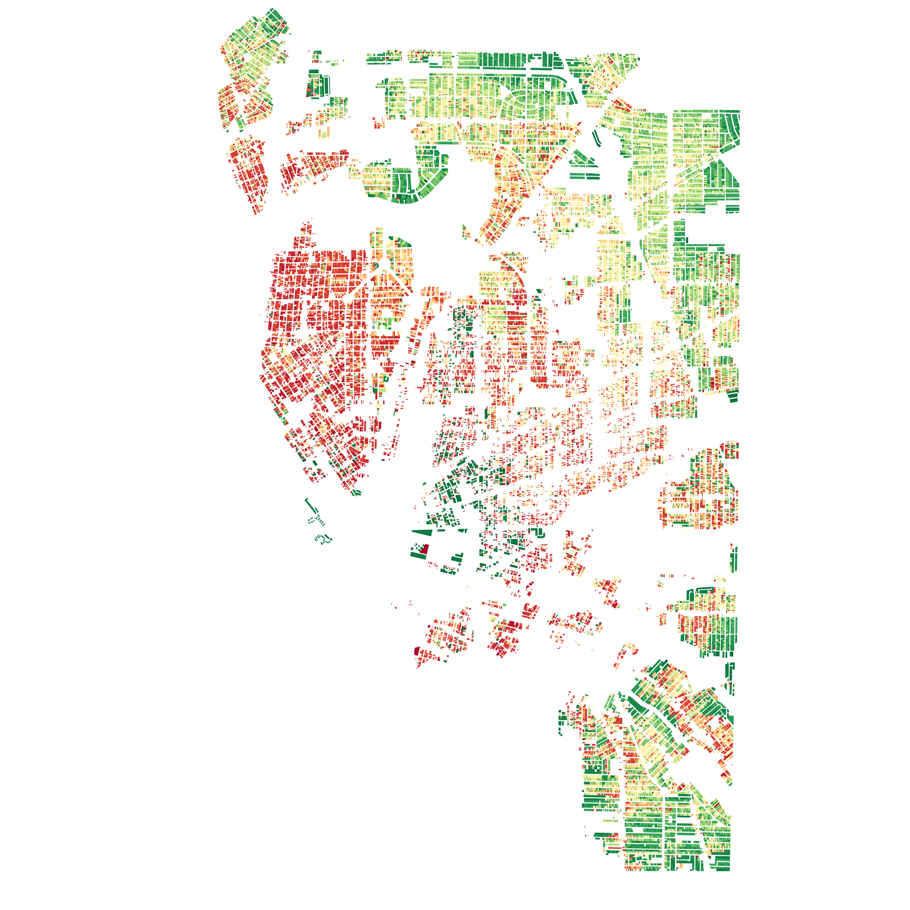

### Most Recent Sale
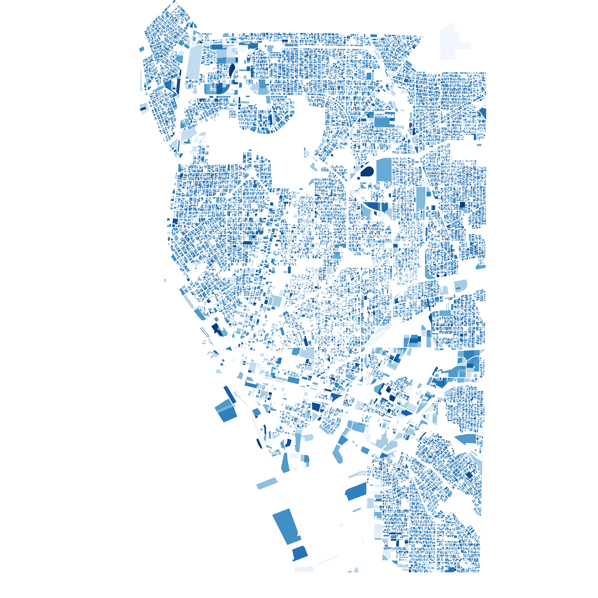
```
mkgeo-render data/buffalo/oars/join9.ndjson   -f 'd.properties && d.properties.oars_props && d.properties.oars_props.last_sale.date'   -M mappers/choropleth.js   -d "{ f: function(d){ return new Date(Date.parse(d.properties.oars_props.last_sale.date)).getFullYear()}, colorScale: d3.scaleSequential(d3.interpolateGreens), minmax: $(echo -n '['; cat data/buffalo/oars/percentiles/last_sale_date.txt | cut -f 2 | tr '\n' ',' | sed 's|,$|]|') }"   --size 8000   -o output/buffalo-properties/last_sale_date
```

## Other parcel features
### Single Family Home Parcel Size heatmap
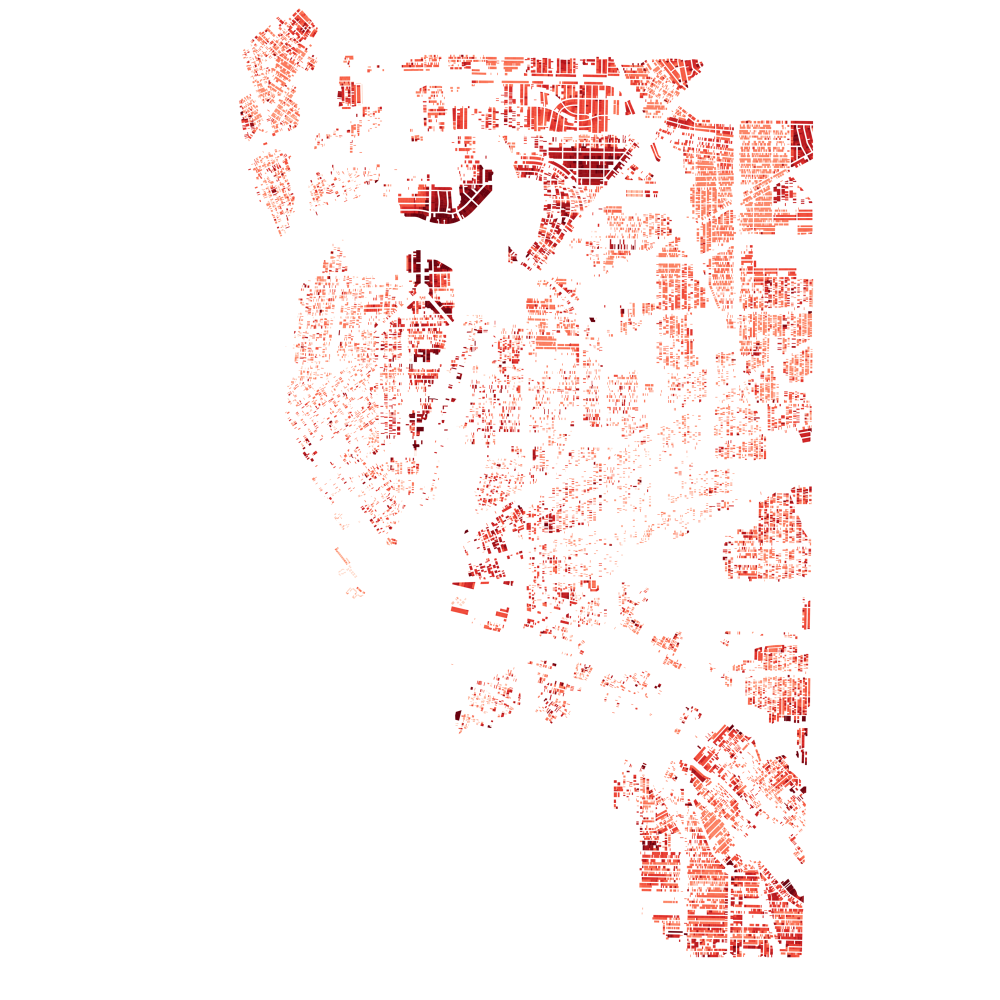

## TODO Future work
* download extra sites for multi-site properties?
* Analyze weird straight lines on west side in bitmap map. Are these old right of ways that were later made properties?
* Assessed price per lot sqft (total land assessment divided by acreage)
* Assessment percentile relative to other properties with same use.

Multi-site properties (multiple buildings, not counting garages) (binary - blue/white, or bitmap/white for clickability)

Not owner occupied (owner 1 address different from property address)
Neighborhood codes (get key?)
non-house space on lot (percentage on a white to green scale)
garage map
map of houses w/more than 5br

categorical map with 1fa homes, schools and green space highlighted
filter: categorical map with only 1fa homes, schools and greenspace
* filter: min house br Count
* score: house location based on total distance to 3 classes of space
* score: house SIZE
* score: bathroom Count
* score: garage, porch, driveway, etc.
* choropleth: acreage [0,0.05,0.1,0.2,0.4,0.8], sqft, acreage_minus_1st_flr_sqft
* choropleth: mv$ per acre
* choropleth: mv$ per bedroom

other thoughts: property acreage slider
last sale slider
zip code filter

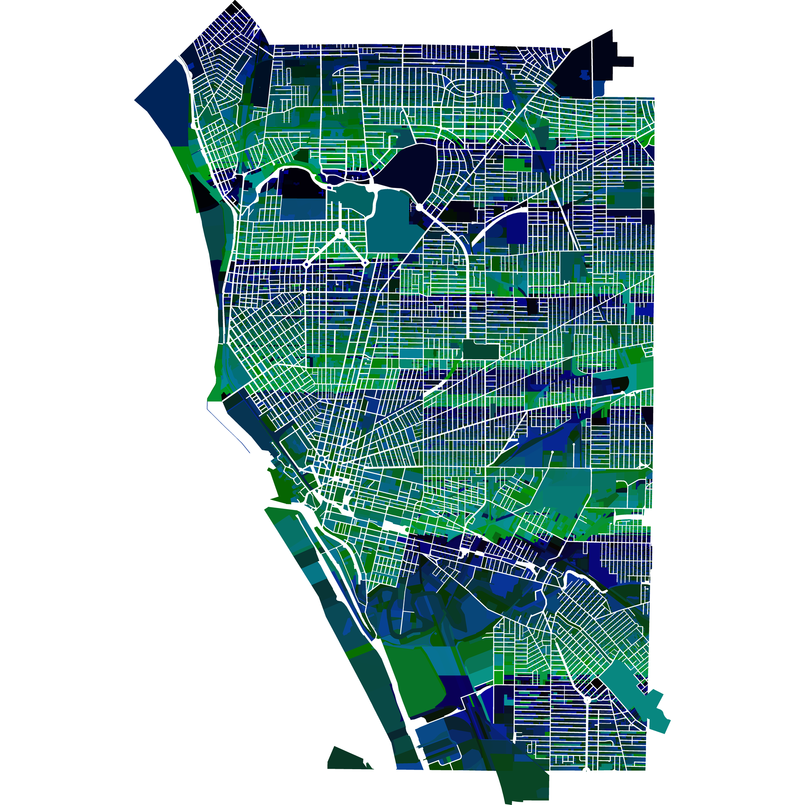

## Issues

```
2019-09-17 01:10:54 starting work on street #152: BROADWAY
2019-09-17 01:10:54     starting work on page 1 of BROADWAY (cumulative 9060)
2019-09-17 01:11:00 exception processing property 384 BROADWAY, Buffalo on page 1 of BROADWAY (152)
Traceback (most recent call last):
  File "/Users/mkomorowski/repos/mkgeo/bin/scrape-oars", line 257, in crawl
    func.__call__(property)
  File "/Users/mkomorowski/repos/mkgeo/bin/scrape-oars", line 93, in ndjson
    property.extended()
  File "/Users/mkomorowski/repos/mkgeo/bin/scrape-oars", line 193, in extended
    owner_addr = tables['Owner Information'].findAll('tr')[2].findAll('td')
IndexError: list index out of range
2019-09-17 01:11:00 continuing
2019-09-17 01:11:02     starting work on page 2 of BROADWAY (cumulative 9160)
2019-09-17 01:11:10     starting work on page 3 of BROADWAY (cumulative 9260)
2019-09-17 01:11:18     starting work on page 4 of BROADWAY (cumulative 9360)
2019-09-17 01:11:26     starting work on page 5 of BROADWAY (cumulative 9460)
2019-09-17 01:11:32     loaded 475 properties on BROADWAY (cumulative 9535)
```

```
2019-09-17 02:44:25 starting work on street #1209: SHIP CANAL PKWY
2019-09-17 02:44:25     starting work on page 1 of SHIP CANAL PKWY (cumulative 76366)
2019-09-17 02:44:25 fetching url SHIP CANAL PKWY.1;	Traceback (most recent call last):
  File "/Users/mkomorowski/repos/mkgeo/bin/scrape-oars", line 287, in <module>
    crawl(STREET_CRAWL, 1, offset)
  File "/Users/mkomorowski/repos/mkgeo/bin/scrape-oars", line 254, in crawl
    traceback.print_exc()
  File "/Users/mkomorowski/repos/mkgeo/bin/scrape-oars", line 124, in properties
    html = fetch(prop_page, cache_file_page(self), '{}.{}'.format(self.street.name, self.number))
  File "/Users/mkomorowski/repos/mkgeo/bin/scrape-oars", line 52, in fetch
    raise Exception('do not make requests')
Exception: do not make requests
```
