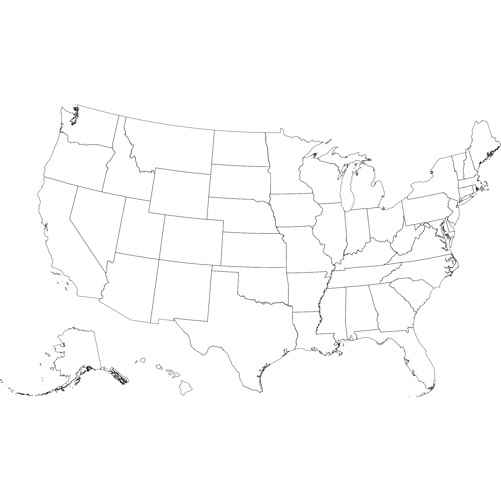
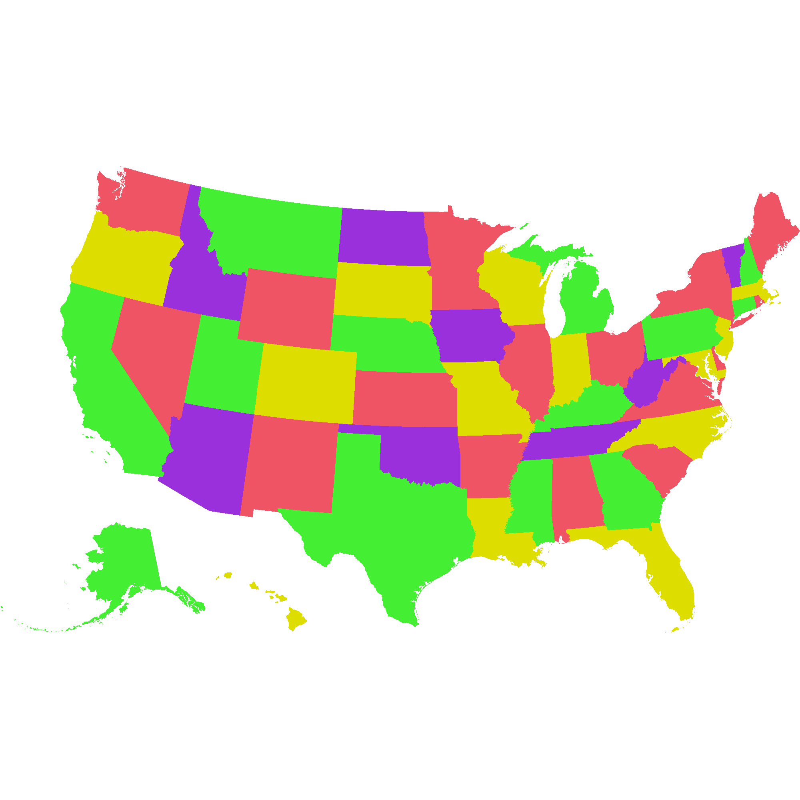
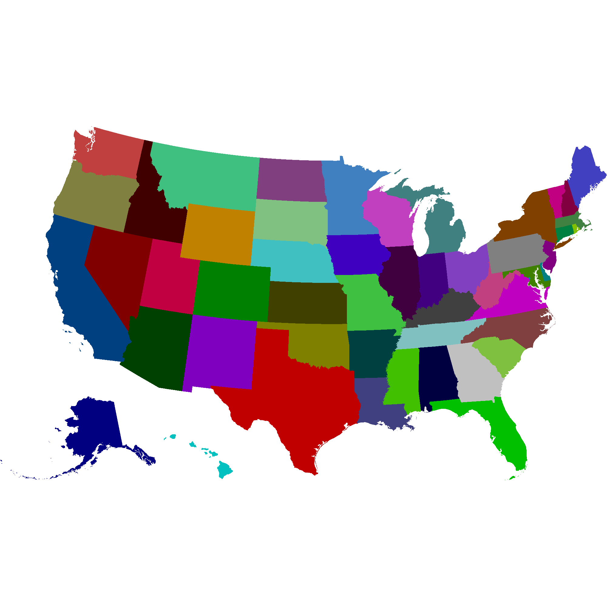
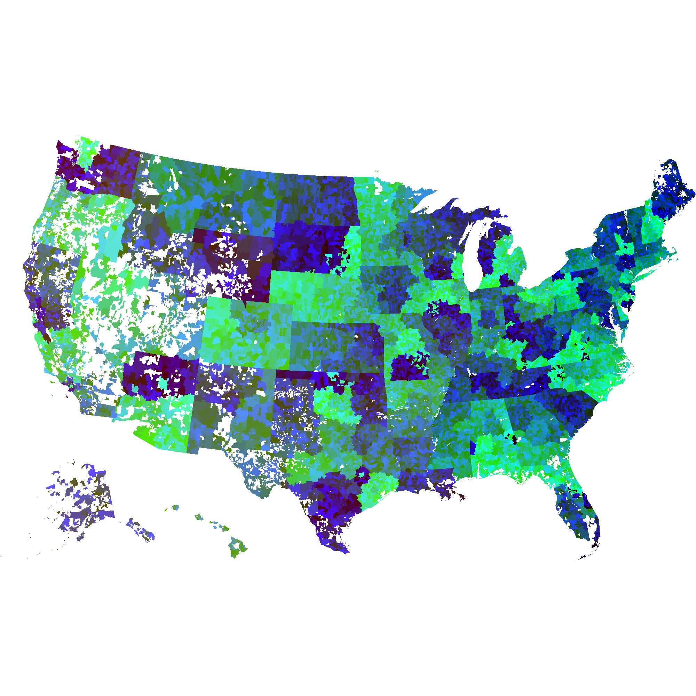
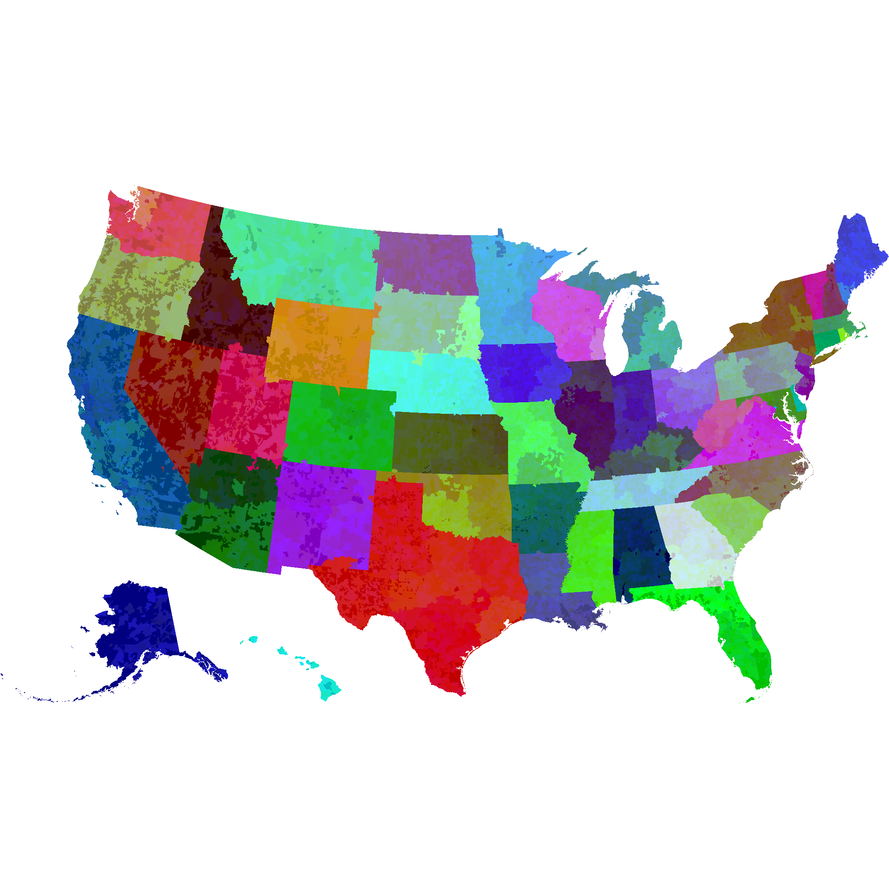
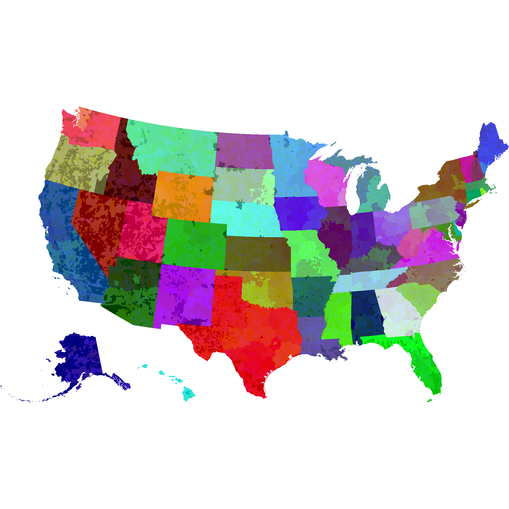

# Zip Code bitmap
This article will describe the creation and use of an image that shows the familiar outlines of U.S. states while also encoding the zip codes of each pixel in the color of the image. This image (plus a little bit of javascript) can be used to map clicks to zips without a server call.

First, some background…

### Political Maps

We learn in grammar school that a "political map" is any map that is primarily designed to show governmental boundaries and regions. This is a useful way to learn geography, and it's again useful for orienting yourself once you know that geography.


*familiar outline of U.S. states. data from [U.S. Census GIS files](https://www.census.gov/programs-surveys/geography/geographies/mapping-files.2017.html)*

Thanks to Appel and Haken, we know that all planar maps can be colored using [no more than 4 colors](https://en.wikipedia.org/wiki/Four_color_theorem). This makes coloring efficient for mapmakers who don't want to put every color of the rainbow on their palette.


*coloring inspired by [wikipedia](https://en.wikipedia.org/wiki/Four_color_theorem#/media/File:Map_of_United_States_vivid_colors_shown.png)*

But you might use more than 4 colors if you want a color choice to tell your audience something about the region. One exercise of this is a [_choropleth_](../choropleth). Another reason you might use many colors in a map rendering is to _encode data_ within the color. That is, if you know the precise color of a point on a map, you could trace it back to some region identifier or other piece of information.

### State bitmap:
Here is a state map with a unique color for each state.



We can then use the html `<canvas>` element to read the colors in that map and spit out the rgb value as you move your mouse.

      rgb on mouseover //TODO every codelet should have a link to the source

If we store an array of state labels, we can then use the same image to show the state abbreviation on mouseover or click!

    # fetch the census file listing counties and states.
    # this file contains the state codes needed to map the state geo data to the state abbreviations
    # wget 'https://www2.census.gov/geo/docs/reference/codes/files/national_county.txt'
    # extract state number to name relationship
    # cat data/census/national_county.txt | tr ',' '\t' | cut -f 1,2 | sort -u | sort -k2 | awk '{print "\""$2"\":\""$1"\","}'
    mkgeo-render data/census/cb_2017_us_state_500k/cb_2017_us_state_500k.ndjson \
      -m 'd.properties.STATEFP + "\":\"" + d.properties.STUSPS' \
      | tr -d "\\" | sed 's/$/,/' | sort

(TODO img w/state name on mouseover) - explain and link to js
TODO explain --crisp option

### Zip code bitmap:
We can go a step further and encode zip codes in our map.
TODO define ZCTA.
TODO talk about precedence and how colors are encoded



So the naive zip code map encodes all the information we need to determine which state and zip each pixel belongs to. But it does not
encode state information in a visually useful way!

(Note about areas not part of a zip)

```
#TODO cleanup
geojson-merge -s cb_2017_us_state_500k/cb_2017_us_state_500k.geojson cb_2017_us_zcta510_500k/cb_2017_us_zcta510_500k.geojson > cb_zips_with_states.geojson
ndjson-split cb_zips_with_states.geojson > cb_zips_with_states.ndjson

wget https://www2.census.gov/geo/docs/maps-data/data/rel/zcta_county_rel_10.txt
cat data/census/zcta_county_rel_10.txt | cut -d ',' -f 2,1 | sort -u | awk -F',' '{print "{ \"properties\": { \"ZCTA5CE10\": \""$1"\", \"STATEFP\": \""$2"\"}}" }' > data/census/zip-to-state.ndjson
ndjson-join --left 'd.properties.ZCTA5CE10' data/census/zips_with_states.ndjson data/census/zip-to-state.ndjson > temp.ndjson
ndjson-map 'd[0].properties.STATEFP = d.length > 1 && d[1] != null ? d[1].properties.STATEFP : d[0].properties.STATEFP, d[0]' < <(cat temp.ndjson) > temp2.ndjson
ndjson-sort 'a.properties.AFFGEOID10 ? a.properties.AFFGEOID10.localeCompare(b.properties.AFFGEOID10) : -1' < temp2.ndjson > temp3.ndjson
```



### Uh oh! multi-state zips!

You probably noticed something unsettling about the above map. That's because there are some ZCTAs that span multiple states, giving the appearance that some states are hemoraging into neighboring states.

```
cat data/census/zcta_county_rel_10.txt | cut -d ',' -f 1,2 | sort -u | cut -d ',' -f 1 | dtk uc | grep -v '^1' | cut -f 2 | tr '\n' ','
```

...Handle it:
1. Find all multistate zctas
```
cat data/census/zcta_county_rel_10.txt | cut -d ',' -f 1,2 | sort -u | cut -d ',' -f 1 | dtk uc | grep -v '^1' | cut -f 2
```
1. We want the multistaters to look like part of each state they're a part of when they're inside that state.
  * One way to do that is to update the ndjson file to split the zips at state lines, but I don't know how to do that (certainly not with my current toolset).
  * Another way to do that is to draw the zip codes in a translucent manner so that the underlying state shines through. The alpha calculation is reversible, so we should be able to recover both the zip and state from these translucent overlays.

[](/mkgeo-gallery/viewer/)
*click on the above map to see the zip code and state on mouseover*

### Why it's useful

This final image weighs in at about 600kB, but this is not large relative to naive encodings of the pixel-to-zipcode map that you would have to have access to in order to map mouseovers or clicks to zipcodes. If you wanted to handle a clickable map without server roundtrips, pre-loading this map would be an efficient way to do that. In short, you allow the size-limiting, non-lossy optimizations of PNGs to do the work of encoding this data.

### The Code

I used many libraries to generate the above images, but all of the custom code is written in javascript.

1. [mkgeo utilities](https://github.com/mkomo/mkgeo)
1. [zip and state bitmap generation and decoding](https://github.com/mkomo/mkgeo/blob/master/mappers/zipbitmap.js)
1. [viewer with mouseover interpretation of colors](https://github.com/mkomo/mkgeo/blob/master/viewer/index.html)

### Notes
[data about pixels per state, pixes per sq mile of this projection]

### next steps

1. [ ] link to the working viewer in github pages
1. [ ] css dramatic mouseover of images and css for caption
1. [ ] command line geometry intersection tool.
1. [ ] color curves working
