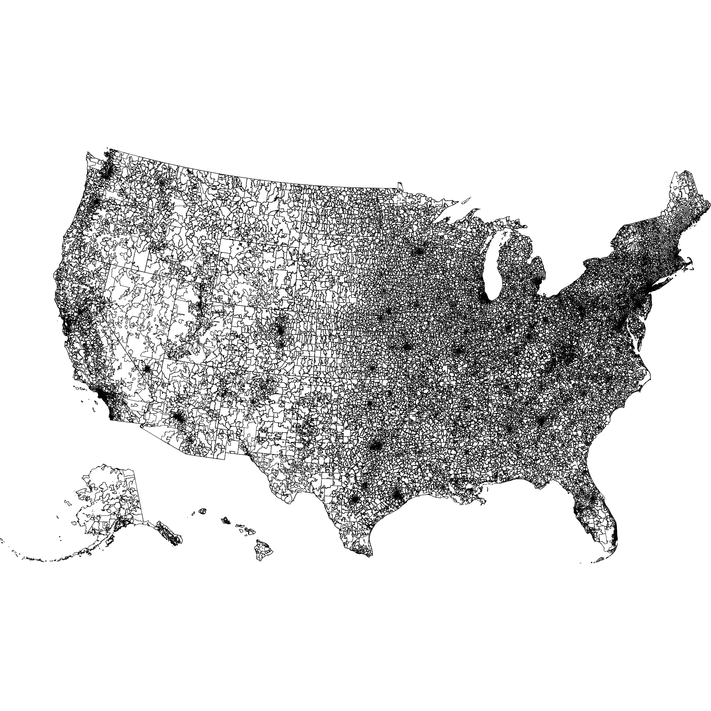
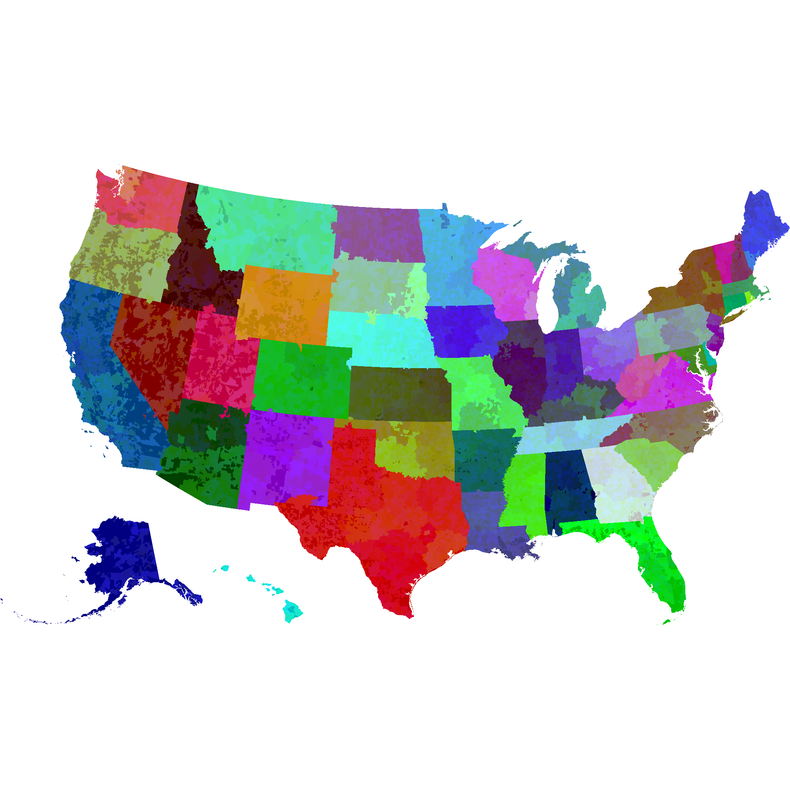

Political Maps

We learn in grammar school that a "political map" is any map that is primarily designed to show governmental boundaries and regions. This is a useful way to learn technology, and it's again useful for orienting yourself once you know that geography.

 //TODO make this just a state map

Thanks to Appel and Haken, we know that all planar maps can be colored with as few as 4 colors. This makes coloring efficient for mapmakers who don't want to put every color of the rainbow on their palette.

[Picture of 4-color US map]

But you might use more than 4 colors if you want a color choice to tell your audience something about the region. One exercise of this is a choropleth. A choropleth map is...TODO

[Choropleth for population density by state]

Another reason you might use many colors in a map rendering is to encode data within the color. That is, if you know the precise color of a point on a map, you could trace it back to some region identifier or other piece of information.

State:

Zip:

So the naive zip code map encodes all the information we need to determine which state and zip each pixel belongs to. But it does not
encode state information in a visually useful way!

(Note about areas not part of a zip)

Zip+State with higher precedence for states

Ahh! multi-state zips!

...Handle it

Why it's useful

It's large, but doesn't require server round trips. (Quaint idea...)

*Notes*
[data about pixels per state, pixes per sq mile of this projection]
